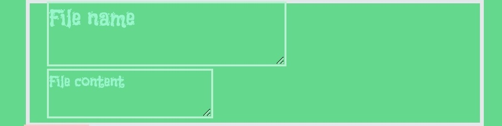
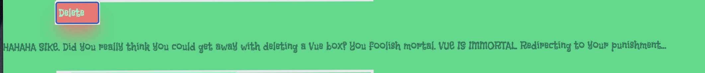
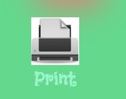

# VueStore


A web service where users can store Vue code and print a copy of all their Vue files

## Instructions


1. Go to StackBlitz
2. Create a new Nuxt project
3. npm install -g pnpm
4. pnpm add --save-dev @nuxtjs/tailwindcss
5. pnpm i image
6. pnpm i @nuxt/fonts
7. Add this to nuxt.config.ts
```ts
modules: [
  '@nuxtjs/tailwindcss',
  '@nuxt/fonts',
  '@nuxt/image',
]
```
8. Copy the code from this Github repo's package.json, remove the old code from the StackBlitz project's package.json, and paste in the repo's code
7. Add printer.jpeg and vuestore.jpeg from the repo into the StackBlitz project
6. Create tailwind.config.js and add this:
```js
import colors from 'tailwindcss/colors'

export default {
  theme: {
    extend: {
      colors: {
        'nuxt-green': "#05DB84",
        'nuxt-mint': "#77F8C9",
      }
    }
  }
}
```
9. Copy the code from the repo's app.vue, remove the StackBlitz project's app.vue code, and paste the repo's Vue code in
10. The website should be up and running! (you may need to save and refresh the project to load the custom colors)


## Features

### The 10 Vue boxes

```html
<div class="border-4 w-1/3 ml-20">
  <textarea id="vuefile" value="File name" class="text-2xl ml-5 bg-nuxt-green ring-2 ring-emerald-200 hover:bg-emerald-700"></textarea><br>
  <textarea id="vuetext" value="File content" class="ml-5 bg-nuxt-green ring-2 ring-emerald-200 hover:bg-emerald-700"></textarea>
</div>
```



Each Vue box contains two textboxes. The first box is where the user can enter the name of the Vue file, and the second box is where the user can paste Vue code.

### Delete button

```html
<button v-on:click="msg" class="ml-20 bg-red-400 flex w-16 p-1 shadow-xl shadow-red-400 ring-2 ring-red-200 active:bg-red-600 active:ring-red-400 hover:bg-red-500">Delete</button>
```

```js
function link() {
  window.location.replace("https://youtu.be/cxrEb7MT84E?si=he-LKskfZBY_ybvN");
}

function msg() {
  const rand = (Math.floor(Math.random() * 11));
  let rand_bool;
  
  if (rand == 7) {
    const para = document.createElement("p");
    const txt = document.createTextNode("HAHAHA SIKE. Did you really think you could get away with deleting a Vue box? You foolish mortal. VUE IS IMMORTAL. Redirecting to your punishment...");
    para.appendChild(txt);

    document.getElementById("msg").appendChild(para);

    setTimeout(link, 10000);
  }
}
```

```html
<div id="msg" class="text-emerald-700"></div>
```




This "delete button" is what makes VueStore *functionally disfunctional*, since this delete button in a working Vue content storage system **doesn't actually delete anything**. It mostly does nothing aside from generating random numbers. But if the number generated is 7, a message will be posted shaming the user for trying to delete the almighty, immortal Vue code before the user faces **A PUNISHMENT**.

Note: you must scroll to the top of the page to see the message

### Print button

```html
<button v-on:click="print" class="ml-20">
  <NuxtImg src="/printer.jpeg" width="40" height="40" />
  Print
</button>
```

```js
function print() {
  window.print();
}
```



Very straightforward. This button just opens the user's device's printing menu so they can print a physical copy of their Vue content. I decided to use a print button because I did not want to spend extra time messing with local storage or a full database, especially since I already wasted enough time ramming my head against so many error walls to make this Nuxt-StackBlitz project work. It's the same reason why I put a fixed amount of Vue boxes instead of letting users add more boxes as needed.

### Design choices

1. I chose the Flavors font for this website to match the *functionally disfunctional* theme. A silly font pairs well with a silly quirk in the project.
2. The mostly green color palette is an omage to the Nuxt and Vue logos
3. The abundant hover and active properties, colored shadows, and rings in this website were added to make it seem more dynamic and epic. In other words, the insanely overengineered UI shows that I'm the top G of website design :)


